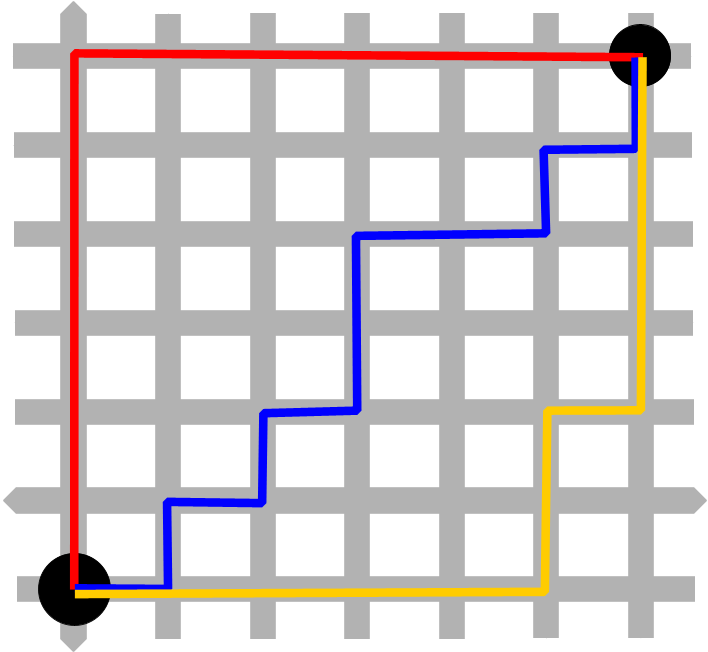

# AStar

By default this uses Manhattan distance as heuristics, so perfect for 4-way movement 2D grid maps,
replace it with Euclidean distance for a free movement map or Chebyshev diagonal distance for 8-way movement



# Library

```cpp
int FindPath(const int nStartX, const int nStartY,
             const int nTargetX, const int nTargetY,
             const unsigned char *pMap, const int nMapWidth, const int nMapHeight,
             int *pOutBuffer, const int nOutBufferSize)

// nStartX and nStartY are the starting position
// nTargetX and nTargetY are the ending position
// pMap* is a pointer to the 2D grid map, 1 = walkable, 0 = wall
// nMapWidth and nMapHeight are the map size
// pOutBuffer will contain a list of indices of pMap containing the resulting path
// nOutBufferSize is how big pOutBuffer is

```

Check [Tests](/Tests) to see how it's used

# Build

The library uses C++17 and CMake 3.22 or newer. A library-only build has no
external dependencies:

```sh
cmake -S . -B build/library -DBUILD_TESTING=OFF
cmake --build build/library --parallel
```

To build and run the pathfinding tests, CMake fetches GoogleTest v1.16.0:

```sh
cmake -S . -B build/tests -DBUILD_TESTING=ON
cmake --build build/tests --parallel
ctest --test-dir build/tests --output-on-failure
```

The two `StaticAnalyzer` tests in `Tests/Test.cpp` use paths under
`/home/.../Desktop/AStar`, so CTest excludes them. They can be run manually
after adapting those paths to a local checkout.

# License

Note: the above image is not mine

See [LICENSE](/LICENSE) file
