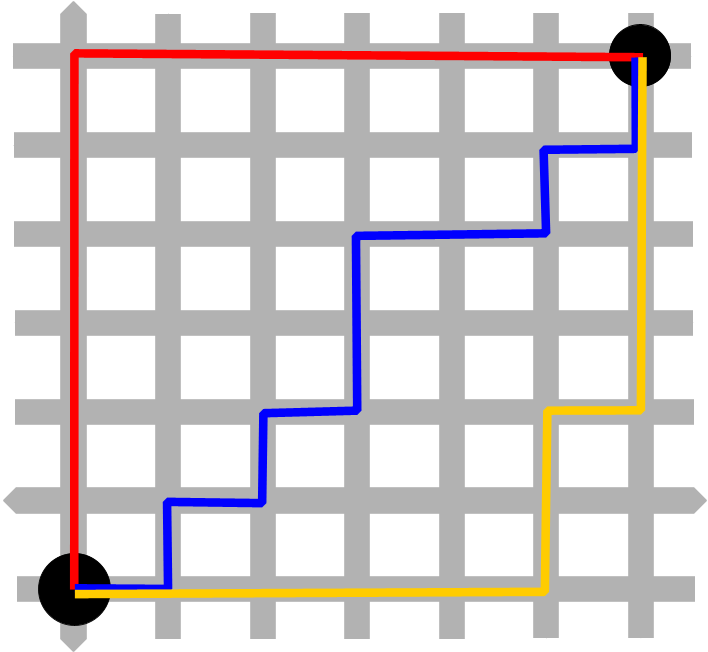

# AStar

By default this uses Manhattan distance as heuristics, so perfect for 4-way movement 2D grid maps,
replace it with Euclidean distance for a free movement map or Chebyshev diagonal distance for 8-way movement



# Library

```cpp
int FindPath(const int nStartX, const int nStartY,
             const int nTargetX, const int nTargetY,
             const unsigned char *pMap, const int nMapWidth, const int nMapHeight,
             int *pOutBuffer, const int nOutBufferSize)

// nStartX and nStartY are the starting position
// nTargetX and nTargetY are the ending position
// pMap* is a pointer to the 2D grid map, 1 = walkable, 0 = wall
// nMapWidth and nMapHeight are the map size
// pOutBuffer will contain a list of indices of pMap containing the resulting path
// nOutBufferSize is how big pOutBuffer is

```

Check [Tests](/Tests) to see how it's used

# Build

It's C++17, Just use CMake, no dependencies needed

# License

Note: the above image is not mine

See [LICENSE](/LICENSE) file